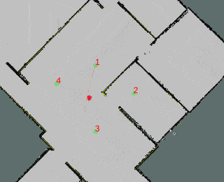

MICVISION
===

# Description

This package provides a lot of functions for robot operations in both real and
stage environment.

The main functions list:
1. Autonomous navigation
2. Autonomous mapping
3. Self-localization
4. Autonomous obstacle avoidance
5. Dynamic path planning

# Dependencies

1. [navigation](https://github.com/tyuownu/navigation)
2. [cartographer](https://github.com/tyuownu/cartographer)
3. [cartographer_ros](https://github.com/tyuownu/cartographer_ros)
4. [cartographer_turtlebot](https://github.com/tyuownu/cartographer_turtlebot)
5. [ceres-solver](https://github.com/tyuownu/ceres-solver)
6. [stage_ros](https://github.com/tyuownu/stage_ros)

# Install

First, we need to download the packages. Run:

```shell
cd docs/scripts/
bash download.sh
```

Second, we build the packages.
```shell
# change to your catkin workspace
cd your-catkin-workspace
catkin_make_isolated
```

# Packages

__The package list in this repository.__

## micvision

### micvision_exploration

`micvision_exploration`: to explore the whole map of the unknown environment.

### micvision_localization

`micvision_localization`: to localize the robot in a map.

### micvision_patroller

`micvision_patroller`: to patrol at the specified location.

## micvision_sim

This package uses the `stage` to simulate the real environment, you can use the
`stage_ros` from the ROS or use the `stage_ros` that we provide. The difference
between these two versions is, the laser scan data in `stage_ros` provided by
ROS is very accurate while the data provided by us is corrupted with noise.

The package also has two parts: `mapping` and `navigation`.

### mapping

usage:

```shell
# willow world
roslaunch micvision_sim willow-mapping-sim.launch

# or use maze world below
# roslaunch micvision_sim maze-mapping-sim.launch

# then, in another terminal
rosservice call /StartExploration

# we also provide other commands to control the robot
# Stop the exploration action
rosservice call /StopExploration

# Stop the robot
rosservice call /Stop

# Pause the robot
rosservice call /Pause
```

### navigation

usage:

```shell
# willow world
roslaunch micvision_sim willow-navigation-sim.launch
# or use maze world instead
# roslaunch micvision_sim maze-navigation-sim.launch

# find the location of the robot
rosservice call /StartLocalization

# click on the map using rviz, and the robot will move to it
```

### patroller



usage:
```shell
# run in the navigation mode
roslaunch micvision_sim willow-navigation-sim.launch
# using the RVIZ button `Publish Point` to assign some location to patroller
# Than start patroller
rosservice call /StartPatroller

# or stop patroller
rosservice call /StopPatroller

# or reset the patroller
rosservice call /ResetPatroller
```

## micvision_mapping

__This package provides the real world & robot for mapping.__

Click the link below to view a video showing mapping:
[](https://youtu.be/MACHfxqYty0)


You can use it with `turtlebot2(kobuki)` or `turtlebot3`.

Usage:

```shell
# turtlebot2
roslaunch micvision_mapping mapping_turtlebot2.launch

# turtlebot3
roslaunch micvision_mapping mapping_turtlebot3.launch

# other commands please refer to the micvision_sim mapping function
```

## micvision_navigation

__This package provide the real world and robot for autonomous navigation and self-localization.__

Click the link below to view a video showing self-localization and autonomous navigation:
[](https://youtu.be/cGjrXOYjWjk)

You can use it with `turtlebot2(kobuki)` or `turtlebot3`.

Usage:

```shell
# turtlebot2
roslaunch micvision_navigation navigation_turtlebot2.launch

# turtlebot3
roslaunch micvision_navigation navigation_turtlebot3.launch

# other commands please refer to the micvision_sim navigation function
```

